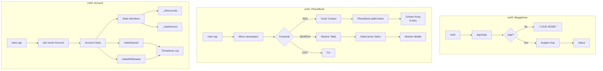

# CPP Module00 - Fundamentos de C++ yPOO


---

## Descripción

Módulo introductorio de C++ del currículum de Escuela 42 que establece los fundamentos de la programación orientada a objetos mediante tres ejercicios progresivos: manipulación de I/O streams, diseño de clases con encapsulación, e implementación de miembros estáticos con gestión de memoria manual.

---

## Características Principales

### Megaphone (ex00)
- Transformación de argumentos CLI a mayúsculas
- Manejo de `argc/argv` y flujos `std::iostream`
- Mensaje por defecto cuando no hay input

### PhoneBook (ex01)
- Agenda telefónica interactiva (máximo 8contactos)
- Arquitectura multi-clase: `PhoneBook`, `Contact`, `Menu`
- Implementación completa de **Rule of Three** (constructor copia, operador asignación, destructor)
- Validación de entrada con interfaz ASCII tabular
- Comandos: `ADD`, `SEARCH`, `EXIT`

### Account (ex02)
- Sistema de cuentas bancarias con depósitos/retiros
- Miembros estáticos para tracking global del sistema
- Logging con timestamps
- Uso de STL: `std::vector`, `std::for_each`, `std::mem_fun_ref`

---

## Stack Tecnológico

| Categoría | Tecnología |
|-----------|------------|
| Lenguaje | C++98 |
| Compilador | c++ (clang/g++) |
| Build System | Makefile |
| Librerías | `<iostream>`, `<string>`, `<vector>`, `<algorithm>`, `<iomanip>`, `<ctime>`, `<sstream>` |
| Herramientas | AddressSanitizer (-fsanitize=address) |

---

## Decisiones Técnicas

El uso de **C++98** como estándar obligatorio es una decisión pedagógica intencionada de Escuela 42. Sin las comodidades de C++11/14/17 (smart pointers, auto, lambdas), el desarrollador debe dominar:

- **Gestión manual de memoria**: Responsabilidad total del ciclo de vida de objetos
- **Rule of Three**: Implementación explícita de constructores de copia y operadores de asignación para evitar memory leaks y double frees
- **Encapsulación estricta**: Uso de `private/public`, getters/setters, yoeclusion de implementación
- **STL clásico**: Algoritmos como `std::for_each` con adaptadores `std::mem_fun_ref`, patrones fundamentales en código legacy empresarial

La arquitectura modular con Makefiles separados permite testing aislado y compilación incremental, siguiendo las buenas prácticas de sistemas de build_unix.

---

## Diagrama de Arquitectura



---

## Guía de Instalación

### Requisitos

- Compilador C++ (g++ o clang++)
- Make

### Compilación

```bash
git clone https://github.com/samuelhm/CPP-Module-00.git
cd CPP-Module-00

# ex00 - Megaphone
cd ex00 && make&& ./megaphone "hello world"

# ex01 - PhoneBook
cd ../ex01 && make && ./phonebook

# ex02 - Account
cd ../ex02 && make && ./account
```

### Comandos Make

```bash
make        # Compilar proyecto
make clean  # Eliminar objetos
make fclean # Limpiar binarios
make re     # Recompilar desde cero
```

---

## Contacto

| Plataforma | Enlace |
|------------|--------|
| GitHub | [github.com/samuelhm](https://github.com/samuelhm/) |
| LinkedIn | [linkedin.com/in/shurtado-m](https://www.linkedin.com/in/shurtado-m/) |

---

*Proyecto del currículum de Escuela 42 Barcelona.*